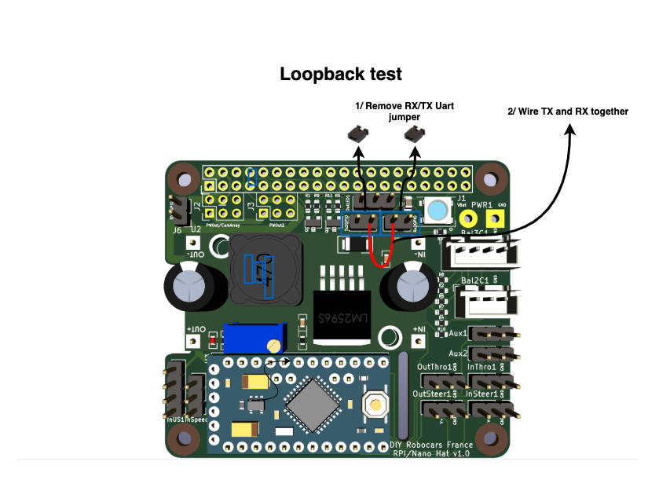

# This repository contains the hardware part of the DIYRobocarsFr Hat.

## Intro
This Hat is designed for Raspberry Pi 3/4, Jetson Nano or any other SBC implementing the well known 'rpi' GPIO connector.
This Hat provides various interfaces between SBC (Single Board Controler) and hardware to easely build an autonomous small scale RC-style car.
A typical example of such build is the [Donkey car](https://www.donkeycar.com/)

The Hat combines :
- LM2596 or xl4005 DSN5000 based DC/DC converter to power everything from a single battery (7-15V, NiMh or LiPo 2S/3S), through GPIO or through dedicated connector.
- Arduino pro mini 5V 16Mhz, which drive I/O (PWM Inpput/output, Ultrasonic sensor, RPM sensor, ...). 5V version is prefered since most of the sensors works at 5v.
- Serial communication link between Arduino and SBC through GPIO pin 8 and 10, with level shift 5v/3.3V 
- Tension divider bridge for Battery monitoring
- RBG Led to display status
- compatibility (stackable) with Arducam CamArray

The Hat has the following I/O :
- 40 pin header GPIO compatible with Raspberry PI and Nvidia Jetson with UART0 wired to the arduino through level shift
- 3 Battery power in connectors (2 wires, 3 wires or 4 wires)
- 2 PWM Inputss to connect RC Receiver (Throttle and Steering input)
- 2 PWM Outputs to connect drive train (ESC and Servo, for Throttle and Steering output) 
- 2 PWM Aux Inputs/Outputs
- 1 input for RPM sensor
- 1 input for UltraSOund sensor
- Aux connector for additional power output (5V and 3.3V) and to stack ArduCam CamArray
- WS2812B compatible output to control more RGB Led

The follwing jumpers are provided for convenience :
- 5V to GPIO : to inject 5V power supply to the Host through GPIO connector (to power Raspberry or Jetson Nano from the main Battery).
For other Hosts, please check documentation
- UART0 RX/TX Jumper : Usually, you need those jumpers since all communication between Host and Hat goes through this UART. Removing those jumpers could be needed to isolate Arduino UART while re-flashing it (especially if Host is powered on at flahsing time).

## Wiring
A typical wiring of the Hat is shown below : 

## Schematic

Consult [Schematics.pdf](doc/Schematics.pdf)

## Note on PWM Block

### Power supply
Hat does not provide power supply through PWM Inputs/Outpus. It is usualy duty of the motor controller (ESC) which feature a BEC.
This is to avoid mixing logic and actuators on the same power source. It means that as long as ESC is not connected and switchded on, Servo and RX Receiver will not be powered.

### output Idle signal
In the current implementation,

- First, as soon as the Hat is powered, a default Idle signal is driven (1,5ms pulse width)
This default idle signal could differ from the one you could have when doing calibration. 

- Second, many ESC will autocalibrate to this idle signal at startup time (when switched on) 

If you are in that case, it is recommanded to switch on the ESC only after the main application is up and running.

## Dependencies

Third party components libraries needed :

* [LM2596 DC to DC buck/step-down module](https://github.com/yet-another-average-joe/KiCad-Chinese_Modules/tree/main/DCDC_StepDown_LM2596)

* https://github.com/g200kg/kicad-lib-arduino.git

## Firmware

### Source
Firmware to upload to the Arduino ca be found [here](https://github.com/btrinite/robocars_hat)

### Flash firmware
To flash firmware, you need to connect a 5V FTDI adaptor featuring DTR signal and use Arduino IDE to flash/upload the content.
Do not forget to solder Pin header connector on Arduino Pins dedicated for uploading/flash purpose.
You can find more informations [here](https://www.arduino.cc/en/Guide/ArduinoProMini)

## Troubleshooting

### Loopback test (only applicable when using SimpleSerial protocol version of the firmware)
SimpleSerial protocol messages that carry throttle and steering are almost symetrical. Thus, if you loopback the serial comunication (RX wired to TX), the Hat will
work in loopback mode. Throttle/Steering orders received from RX Receiver will be used to drive Throttle/Steering output.

Loopback mode is achieved by :
- removing Rx/Tx jumpers to decouple UART signal from Host
- Wiring Rx and Tx together

This is illsutrated below : 

## Example of integration
Modified Donkeycar software with integration of the DIYRobocarsFr Hat is available [here](https://github.com/btrinite/donkey_with_robocars_hat)

## Credits
Based on https://github.com/devbisme/RPi_Hat_Template

