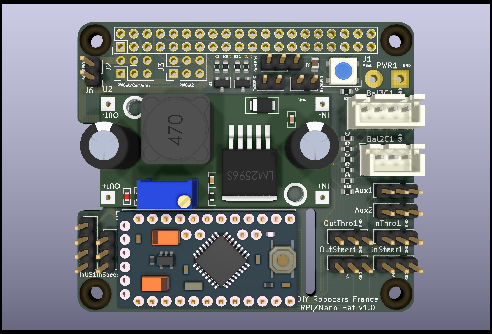

This repository contains the hardware part of the DIYRobocarsFr Hat.

This Hat is designed for Raspberry Pi 3/4, Jetson Nano or any other SBC implementing the well known 'rpi' GPIO connector.
This Hat provides various interfaces between SBC (Single Board Controler) and hardware to easely build an autonomous small scale RC-style car.
A typical example of such build is the [Donkey car](https://www.donkeycar.com/)

The Hat combines :
- LM2596 or xl4005 DSN5000 based DC/DC converter to power everything from a single battery (7-15V, NiMh or LiPo 2S/3S), through GPIO or through dedicated connector.
- Arduino pro mini 5V 16Mhz, which drive I/O (PWM Inpput/output, Ultrasonic sensor, RPM sensor, ...). 5V version is prefered since most of the sensors works at 5v.
- Serial communication link between Arduino and SBC through GPIO pin 8 and 10, with level shift 5v/3.3V 
- Tension divider bridge for Battery monitoring
- RBG Led to display status
- compatibility (stackable) with Arducam CamArray

The Hat has the following I/O :
- 40 pin header GPIO compatible with Raspberry PI and Nvidia Jetson with UART0 wired to the arduino through level shift
- 3 Battery power in connectors (2 wires, 3 wires or 4 wires)
- 2 PWM Inputss to connect RC Receiver (Throttle and Steering input)
- 2 PWM Outputs to connect drive train (ESC and Servo, for Throttle and Steering output) 
- 2 PWM Aux Inputs/Outputs
- 1 input for RPM sensor
- 1 input for UltraSOund sensor
- Aux connector for additional power output (5V and 3.3V) and to stack ArduCam CamArray
- WS2812B compatible output to control more RGB Led

The follwing jumpers are provided for convenience :
- 5V to GPIO : to inject or not 5V from embedded DC/DC converter to 40 pin header GPIO (used typically to power raspberry from the Hat)
- UART0 RX/TX Jumper : to isolate Arduino UART from Rasperry UART, usefull to re-flash in-situ the Arduino

Consult [Schematics.pdf](doc/Schematics.pdf)

Third party components libraries needed :
* [LM2596 DC to DC buck/step-down module](https://github.com/yet-another-average-joe/KiCad-Chinese_Modules/tree/main/DCDC_StepDown_LM2596)
* https://github.com/g200kg/kicad-lib-arduino.git

Software to upload to the Arduino is [here](https://github.com/btrinite/robocars_hat)
Modified Donkeycar software with integration of the DIYRobocarsFr Hat is available [here](https://github.com/btrinite/donkey_with_robocars_hat)

Based on https://github.com/devbisme/RPi_Hat_Template

